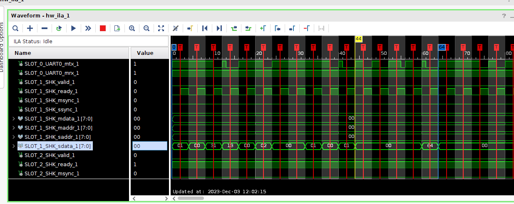

`timescale 1ns / 1ps
/*
           
 <details> 
           
```verilog
*/
// *******************************************************************************
// Company: Fpga Publish
// Engineer: FP 
// 
// Create Date: 2023/12/01 23:58:30
// Design Name: 
// Module Name: cmd_rd_shk
// Project Name: 
// Target Devices: ZYNQ7010 | XCZU2CG | Kintex7
// Tool Versions: 2021.1 || 2022.2
// Description: 
//         * write a cmd from shk byte module
// Dependencies: 
//         * 
// Revision: 0.01 
// Revision 0.01 - File Created
// Additional Comments:
// 
// *******************************************************************************
/* end verilog
```
# interface          
          
 </details> 
           

           
 <details> 
           
```verilog
*/

module cmd_rd_shk #(
    //mode
    parameter MD_SIM_ABLE = 0,
    parameter MD_CMD_START = 32'h1331_0001,
    //number
    parameter NB_PKG_SIZE = 964,
    parameter NB_PKG_HEAD = 3,
    //width
    parameter WD_SLEEP_SPAN = 30,
    //#shake bus
    parameter WD_SHK_DATA = 8,
    parameter WD_SHK_ADDR = 8,
    //#cmd bus
    parameter NB_CMD_ORDE = 128,
    parameter WD_CMD_DATA = 32,
    parameter WD_ERR_INFO = 4
   )(
    //system signals
    input           i_sys_clk  ,  
    input           i_sys_resetn,  
    
    //shake master src
    output                      m_shk_rd_valid,
    output                      m_shk_rd_msync,
    output   [WD_SHK_DATA-1:0]  m_shk_rd_mdata,
    output   [WD_SHK_ADDR-1:0]  m_shk_rd_maddr,
    input                       m_shk_rd_ready,
    input                       m_shk_rd_ssync,
    input    [WD_SHK_DATA-1:0]  m_shk_rd_sdata,
    input    [WD_SHK_ADDR-1:0]  m_shk_rd_saddr, 
    //cmd output 
    output   [WD_CMD_DATA*NB_CMD_ORDE-1:0]  m_cmd_dst_arry,
    
    //error info feedback
    output   [WD_ERR_INFO-1:0]  m_err_cmd_info1
);
//========================================================
//function to math and logic

//========================================================
//localparam to converation and calculate
localparam NB_CMD_BYTE = WD_CMD_DATA / WD_SHK_DATA;
function automatic integer LOG2(input integer N);
begin
    N = N - 1;
    for(LOG2 = 0; N > 0; LOG2 = LOG2 + 1)
    begin
        N = N >> 1;
    end
end 
endfunction
localparam WD_CMD_BYTE = LOG2(NB_CMD_BYTE);
//========================================================
//register and wire to time sequence and combine
// ----------------------------------------------------------
// sleep span
reg [WD_SLEEP_SPAN-1:0] r_sleep_cmt;
wire                    w_sleep_flag; //span time not recv uart data
// ----------------------------------------------------------
// src read shk
reg                     r_shk_rd_ready;
wire                    w_shk_rd_ready_pos;
reg                     r_shk_rd_ready_pos_d1; //make data match addr
reg [WD_SHK_DATA*NB_CMD_BYTE-1:0]   r_shk_rd_sdata_fifo;
reg [WD_CMD_BYTE-1:0]               r_shk_rd_sdata_byte;
reg [WD_CMD_DATA-1:0]               r_shk_rd_sdata_addr;
reg                                 r_shk_rd_sdata_able;
//decode data
reg [WD_CMD_DATA-1:0]               r_shk_rd_sdata_len;
reg [WD_CMD_DATA-1:0]               r_shk_rd_sdata_xor;
// ----------------------------------------------------------
// dst data
reg [WD_CMD_DATA-1:0]r_cmd_dst_fifo [0:NB_CMD_ORDE-1];
//========================================================
//always and assign to drive logic and connect
// ----------------------------------------------------------
// src shk
always@(posedge i_sys_clk)
begin
    if(!i_sys_resetn) //system reset
    begin
        r_shk_rd_ready <= 1'b0; //
        r_shk_rd_ready_pos_d1 <= 1'b0;
    end
    else if(1) //
    begin
        r_shk_rd_ready <= m_shk_rd_ready;  //
        r_shk_rd_ready_pos_d1 <= w_shk_rd_ready_pos;
    end
end
assign w_shk_rd_ready_pos = m_shk_rd_ready && !r_shk_rd_ready;
//temp data
generate genvar i;
    //public width calculate
    `define WSD  WD_SHK_DATA*(i+1)-1:WD_SHK_DATA*i
    `define WSD1 WD_SHK_DATA*(i+2)-1:WD_SHK_DATA*(i+1)
    
    for(i = 0; i < NB_CMD_BYTE; i = i + 1)
    begin:FOR_NB_CMD_BYTE
        always@(posedge i_sys_clk)
            begin
                if(!i_sys_resetn) //system reset
                begin
                    r_shk_rd_sdata_fifo[`WSD] <= 1'b0; //
                end
                else if(w_shk_rd_ready_pos) //
                begin
                    if(i == NB_CMD_BYTE - 1)
                    begin
                        r_shk_rd_sdata_fifo[`WSD] <= m_shk_rd_sdata;//
                    end
                    else 
                    begin
                        r_shk_rd_sdata_fifo[`WSD] <= r_shk_rd_sdata_fifo[`WSD1];
                    end
                end
            end
    end
endgenerate
always@(posedge i_sys_clk)
begin
    if(!i_sys_resetn) //system reset
    begin
        r_shk_rd_sdata_able <= 1'b0; //
    end
    else if(w_sleep_flag) 
    begin
        r_shk_rd_sdata_able <= 1'b0; //
    end
    else if(r_shk_rd_sdata_fifo == MD_CMD_START 
        &&  r_shk_rd_sdata_addr == 0) //
    begin
        r_shk_rd_sdata_able <= 1'b1;  //
    end
end
always@(posedge i_sys_clk)
begin
    if(!i_sys_resetn) //system reset
    begin
        r_shk_rd_sdata_byte <= 1'b0; //
    end
    else if(r_shk_rd_sdata_able) //
    begin
        if(w_shk_rd_ready_pos)
        begin
            r_shk_rd_sdata_byte <=  //r_shk_rd_sdata_byte == NB_CMD_BYTE - 1'b1 ? 1'b0 : //NB_CMD_BYTE must be 2^n
                                    r_shk_rd_sdata_byte + 1'b1; //
        end
    end
    else 
    begin
        r_shk_rd_sdata_byte <= 1'b0;
    end
end
always@(posedge i_sys_clk)
begin
    if(!i_sys_resetn) //system reset
    begin
        r_shk_rd_sdata_addr <= 1'b0; //
    end
    else if(!r_shk_rd_sdata_able)
    begin
        r_shk_rd_sdata_addr <= 1'b0;
    end
    else if(r_shk_rd_sdata_able) //
    begin
        if(r_shk_rd_sdata_byte == NB_CMD_BYTE - 1'b1 
        && w_shk_rd_ready_pos)
        begin
            r_shk_rd_sdata_addr <=  r_shk_rd_sdata_addr + 1'b1; //
        end
    end
end
always@(posedge i_sys_clk)
begin
    if(!i_sys_resetn) //system reset
    begin
        r_shk_rd_sdata_len <= 1'b0; //
        r_shk_rd_sdata_xor <= 1'b0;
    end
    else if(r_shk_rd_ready_pos_d1
        &&  r_shk_rd_sdata_byte == 0
        &&  r_shk_rd_sdata_able) //
    begin
        case(r_shk_rd_sdata_addr) //depkg
            1:              r_shk_rd_sdata_len <= r_shk_rd_sdata_fifo;
            NB_PKG_SIZE-1:  r_shk_rd_sdata_xor <= r_shk_rd_sdata_fifo;
        endcase
    end
end
// ----------------------------------------------------------
// sleep span
always@(posedge i_sys_clk)
begin
    if(!i_sys_resetn) //system reset
    begin
        r_sleep_cmt <= 1'b0; //
    end
    else if(w_shk_rd_ready_pos)
    begin
        r_sleep_cmt <= 1'b0;
    end
    else if(!r_sleep_cmt[WD_SLEEP_SPAN-1]) //
    begin
        r_sleep_cmt <= r_sleep_cmt + 1'b1;  //
    end
end
assign w_sleep_flag = r_sleep_cmt[WD_SLEEP_SPAN-1];
// ----------------------------------------------------------
// dst
generate genvar j;
    for(j = 0; j < NB_CMD_ORDE; j = j + 1)
    begin:FOR_NB_CMD_ORDE
        always@(posedge i_sys_clk)
        begin
            if(!i_sys_resetn) //system reset
            begin
                r_cmd_dst_fifo[j] <= 1'b0; //
            end
            else if(r_shk_rd_ready_pos_d1
                &&  r_shk_rd_sdata_byte == 0
                &&  r_shk_rd_sdata_able) //
            begin
                if(j + NB_PKG_HEAD == r_shk_rd_sdata_addr)
                begin
                    r_cmd_dst_fifo[j] <= r_shk_rd_sdata_fifo; //
                end
            end
        end
        assign m_cmd_dst_arry[WD_CMD_DATA*(j+1)-1:WD_CMD_DATA*j] = r_cmd_dst_fifo[j];
        
    end
endgenerate
//========================================================
//module and task to build part of system

//========================================================
//expand and plug-in part with version 

//========================================================
//ila and vio to debug and monitor

endmodule
              
/* end verilog
```           
              
 </details>   
              
## sim        


## ila 

*/            