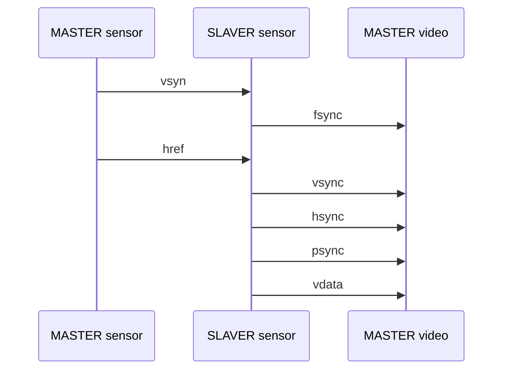

```mermaid
gantt 
title timing
dateFormat X
axisFormat %s
section sensor
s_sensor_src_vsyn:  0,100
s_sensor_src_href:  0,10
section VIDEO
m_video_dst_fsync: 0,100
m_video_dst_vsync: 0,10
m_video_dst_hsync: 0,10
m_video_dst_psync: 0,10

```

`timescale 1ns / 1ps
/*
           
 <details> 
           
```verilog
*/
// *******************************************************************************
// Company: Fpga Publish
// Engineer: FP 
// 
// Create Date: 2023/09/24 21:17:44
// Design Name: 
// Module Name: sensor_to_video
// Project Name: 
// Target Devices: ZYNQ7010 | XCZU2CG | Kintex7
// Tool Versions: 2021.1 || 2022.2
// Description: 
//         * 
// Dependencies: 
//         * 
// Revision: 0.01 
// Revision 0.01 - File Created
// Additional Comments:
// 
// *******************************************************************************
/* end verilog
```
           
 </details> 
           

           
 <details> 
           
```verilog
*/
module sensor_to_video #(
    //mode
    parameter MD_SIM_ABLE = 0,
    //number
    parameter NB_CLK_FRE  = 24_000_000,
    //width
    parameter WD_CONFIG_INFO = 16,
    parameter WD_VIDEO_INFO = 16,
    parameter WD_VIDEO_DATA = 8,
    parameter WD_SENSOR_DATA = 8,
    parameter WD_ERR_INFO = 4
   )(
    //system signals
    input           i_sensor_clk  ,  
    input           i_sys_resetn,  
    //sensor sensor interface
    input                       s_sensor_src_pclk,
    output                      s_sensor_src_xclk,
    input                       s_sensor_src_vsyn,
    input                       s_sensor_src_href,
    input  [WD_SENSOR_DATA-1:0] s_sensor_src_data,
    //config info
    input  [WD_CONFIG_INFO-1:0] s_cinfo_hsync_start, //3
    input  [WD_CONFIG_INFO-1:0] s_cinfo_hsync_finsh, //723
    //video interface
    output                      m_video_dst_clock,
    output                      m_video_dst_fsync, //equal with sensor vsync
    output                      m_video_dst_vsync, //equal with sensor href
    output                      m_video_dst_hsync,
    output                      m_video_dst_psync,
    output [WD_VIDEO_DATA-1:0]  m_video_dst_vdata,
    //video info 
    output [WD_VIDEO_INFO-1:0]  m_vinfo_dst_fpers, //frame per second
    output [WD_VIDEO_INFO-1:0]  m_vinfo_dst_hcunt,
    output [WD_VIDEO_INFO-1:0]  m_vinfo_dst_fcunt,
    
    //error info feedback
    output   [WD_ERR_INFO-1:0]  m_err_sensor_info1
);
//========================================================
//function to math and logic

//========================================================
//localparam to converation and calculate
localparam WD_INTEGER = 32;
localparam NB_PER_TIEM = 4; //s
/* end verilog
```
           
 </details> 
           

           
 <details> 
           
```verilog
*/
//========================================================
//register and wire to time sequence and combine
// ----------------------------------------------------------
// clock region
wire i_sys_clk;
// ----------------------------------------------------------
// video dst
reg                       r_video_dst_fsync;
reg                       r_video_dst_vsync;
reg                       r_video_dst_hsync;
reg                       r_video_dst_psync;
reg   [WD_VIDEO_DATA-1:0] r_video_dst_vdata;

reg                       r_video_dst_fsync_d1;
reg                       r_video_dst_vsync_d1;
wire                      w_video_dst_fsync_neg;
wire                      w_video_dst_vsync_neg;
// ----------------------------------------------------------
// video info
reg [WD_INTEGER-1:0]     r_time_cnt;
reg [WD_VIDEO_INFO-1:0]  r_vinfo_dst_fpers;
reg [WD_VIDEO_INFO-1:0]  r_vinfo_dst_fnumb;
reg [WD_VIDEO_INFO-1:0]  r_vinfo_dst_hcunt;
reg [WD_VIDEO_INFO-1:0]  r_vinfo_dst_fcunt;


//========================================================
//always and assign to drive logic and connect
// ----------------------------------------------------------
// clock region
assign s_sensor_src_xclk = i_sensor_clk;
assign i_sys_clk = s_sensor_src_pclk; //sensor clock input with interface
assign m_video_dst_clock = i_sys_clk;
// ----------------------------------------------------------
// video dst
always@(posedge i_sys_clk)
begin
    if(!i_sys_resetn) //system reset
    begin
        r_video_dst_fsync <= 1'b0;
        r_video_dst_vsync <= 1'b0;
        r_video_dst_hsync <= 1'b0;
        r_video_dst_psync <= 1'b0;
        r_video_dst_vdata <= 1'b0;
    end
    else if(1) //
    begin
        r_video_dst_fsync <= s_sensor_src_vsyn;
        r_video_dst_vsync <= s_sensor_src_href;
        r_video_dst_hsync <= s_sensor_src_href;
        r_video_dst_psync <= s_sensor_src_href; //
        r_video_dst_vdata <= s_sensor_src_data;  //
    end
end
assign m_video_dst_fsync = r_video_dst_fsync;
assign m_video_dst_vsync = r_video_dst_vsync;
assign m_video_dst_hsync = r_video_dst_hsync;
assign m_video_dst_psync = (r_vinfo_dst_hcunt >= s_cinfo_hsync_start 
                        &&  r_vinfo_dst_hcunt <  s_cinfo_hsync_finsh ) ? r_video_dst_psync :
                            1'b0;
assign m_video_dst_vdata = r_video_dst_vdata;
always@(posedge i_sys_clk)
begin
    if(!i_sys_resetn) //system reset
    begin
        r_video_dst_fsync_d1 <= 1'b0;
        r_video_dst_vsync_d1 <= 1'b0;
    end
    else if(1) //
    begin
        r_video_dst_fsync_d1 <= r_video_dst_fsync;
        r_video_dst_vsync_d1 <= r_video_dst_vsync; //
    end
end
assign w_video_dst_fsync_neg = !r_video_dst_fsync && r_video_dst_fsync_d1;
assign w_video_dst_vsync_neg = !r_video_dst_vsync && r_video_dst_vsync_d1;
// ----------------------------------------------------------
// video info
// reg [WD_VIDEO_INFO-1:0]  r_vinfo_dst_fnumb;
// reg [WD_VIDEO_INFO-1:0]  r_vinfo_dst_hcunt;
// reg [WD_VIDEO_INFO-1:0]  r_vinfo_dst_fcunt;
always@(posedge i_sys_clk)
begin
    if(!i_sys_resetn) //system reset
    begin
        r_time_cnt <= 1'b0; //
    end
    else if(r_time_cnt >= NB_PER_TIEM * NB_CLK_FRE - 1'b1) //2s
    begin
        r_time_cnt <= 1'b0;  //
    end
    else 
    begin
        r_time_cnt <= r_time_cnt + 1'b1;
    end
end
always@(posedge i_sys_clk)
begin
    if(!i_sys_resetn) //system reset
    begin
        r_vinfo_dst_fnumb <= 1'b0; //
    end
    else if(r_time_cnt >= NB_PER_TIEM * NB_CLK_FRE - 1'b1)
    begin
        r_vinfo_dst_fnumb <= 1'b0;
    end
    else if(w_video_dst_fsync_neg) //
    begin
        r_vinfo_dst_fnumb <=  r_vinfo_dst_fnumb + 1'b1; //
    end
end
always@(posedge i_sys_clk)
begin
    if(!i_sys_resetn) //system reset
    begin
        r_vinfo_dst_fpers <= 1'b0; //
    end
    else if(r_time_cnt >= NB_PER_TIEM * NB_CLK_FRE - 1'b1) //
    begin
        r_vinfo_dst_fpers <= r_vinfo_dst_fnumb;  //
    end
end
always@(posedge i_sys_clk)
begin
    if(!i_sys_resetn) //system reset
    begin
        r_vinfo_dst_fcunt <= 1'b0; //
    end
    else if(w_video_dst_fsync_neg) //
    begin
        r_vinfo_dst_fcunt <= 1'b0;  //
    end
    else if(w_video_dst_vsync_neg)
    begin
        r_vinfo_dst_fcunt <= r_vinfo_dst_fcunt + 1'b1;
    end
end
always@(posedge i_sys_clk)
begin
    if(!i_sys_resetn) //system reset
    begin
        r_vinfo_dst_hcunt <= 1'b0; //
    end
    else if(w_video_dst_vsync_neg) //
    begin
        r_vinfo_dst_hcunt <= 1'b0;  //
    end
    else if(r_video_dst_hsync) //not standard video timing
    begin
        r_vinfo_dst_hcunt <= r_vinfo_dst_hcunt + 1'b1;
    end
end
assign m_vinfo_dst_fpers = r_vinfo_dst_fpers;
assign m_vinfo_dst_hcunt = r_vinfo_dst_hcunt;
assign m_vinfo_dst_fcunt = r_vinfo_dst_fcunt;
//========================================================
//module and task to build part of system

//========================================================
//expand and plug-in part with version 

//========================================================
//ila and vio to debug and monitor


endmodule