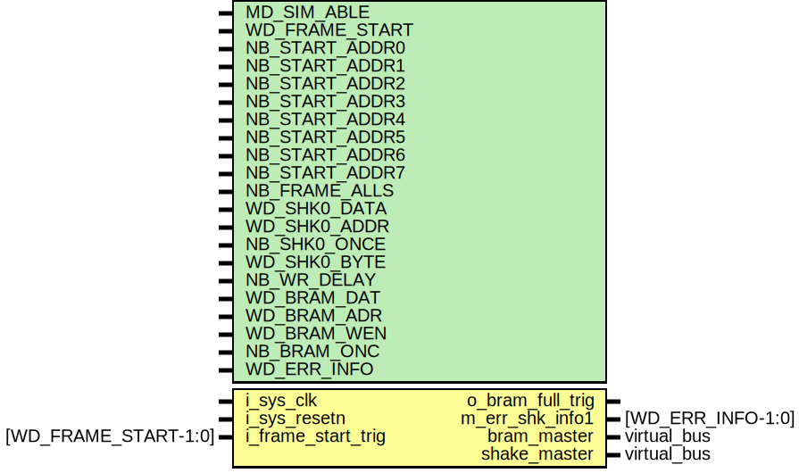
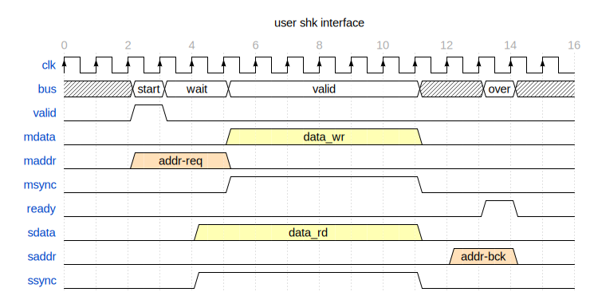
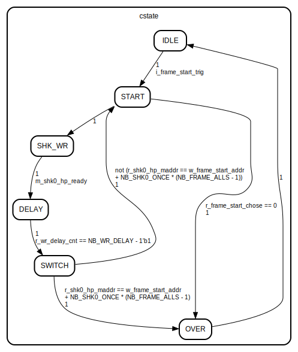

# Entity: shk_to_bram 
- **File**: shk_to_bram.v

## Diagram
<!--  -->

## Description

Company: FpgaPublish

Engineer: FP

Create Date: 2024/01/12 21:19:05

----------------------------
Revision 0.01 - File Created

Revision 0.02 - add exception info solve


<!--  -->


## Generics

| Generic name   | Type | Value                       | Description             |
| -------------- | ---- | --------------------------- | ----------------------- |
| MD_SIM_ABLE    |      | 0                           | mode in sim mode enable |
| WD_FRAME_START |      | 3                           | width of frame start    |
| NB_START_ADDR0 |      | 32'h0000_0000               | ddr start addr 0        |
| NB_START_ADDR1 |      | 32'h0010_0000               | ddr start addr 1        |
| NB_START_ADDR2 |      | 32'h0020_0000               | ddr start addr 2        |
| NB_START_ADDR3 |      | 32'h0020_0000               | ddr start addr 2        |
| NB_START_ADDR4 |      | 32'h0020_0000               | ddr start addr 2        |
| NB_START_ADDR5 |      | 32'h0020_0000               | ddr start addr 2        |
| NB_START_ADDR6 |      | 32'h0020_0000               | ddr start addr 2        |
| NB_START_ADDR7 |      | 32'h0020_0000               | ddr start addr 2        |
| NB_FRAME_ALLS  |      | 720                         | ddr read all times      |
| WD_SHK0_DATA   |      | 32                          | width of shake data     |
| WD_SHK0_ADDR   |      | 32                          | width of shake address  |
| NB_SHK0_ONCE   |      | 2048                        | ddr read addr once      |
| WD_SHK0_BYTE   |      | WD_SHK0_DATA / 8            | shake data bytes        |
| NB_WR_DELAY    |      | 1000                        | write data delay        |
| WD_BRAM_DAT    |      | 32                          | width of bram data      |
| WD_BRAM_ADR    |      | 9                           | width of bram address   |
| WD_BRAM_WEN    |      | 1                           | width of bram write en  |
| NB_BRAM_ONC    |      | NB_SHK0_ONCE / WD_SHK0_BYTE | numb of bram once write |
| WD_ERR_INFO    |      | 4                           | width of error info     |

## Ports

| Port name          | Direction | Type                 | Description                                                         |
| ------------------ | --------- | -------------------- | ------------------------------------------------------------------- |
| i_sys_clk          | input     |                      | in system clock                                                     |
| i_sys_resetn       | input     |                      | in system reset_n                                                   |
| i_frame_start_trig | input     | [WD_FRAME_START-1:0] | frame start                                                         |
| o_bram_full_trig   | output    |                      | bram write full                                                     |
| m_err_shk_info1    | output    | [WD_ERR_INFO-1:0]    | [0]frame start in not IDLE state [1]frame start signal format error |
| bram_master        | out       | Virtual bus          | --bram write                                                        |
| shake_master       | out       | Virtual bus          | --read DDR                                                          |

### Virtual Buses

#### bram_master

| Port name      | Direction | Type              | Description       |
| -------------- | --------- | ----------------- | ----------------- |
| m_bram_wr_addr | output    | [WD_BRAM_ADR-1:0] | bram address      |
| m_bram_wr_clk  | output    |                   | bram clock        |
| m_bram_wr_din  | output    | [WD_BRAM_DAT-1:0] | bram data in      |
| m_bram_wr_dout | input     | [WD_BRAM_DAT-1:0] | bram data out     |
| m_bram_wr_en   | output    |                   | bram enable       |
| m_bram_wr_rst  | output    |                   | bram reset high   |
| m_bram_wr_we   | output    | [WD_BRAM_WEN-1:0] | bram write enable |
#### shake_master

| Port name       | Direction | Type               | Description             |
| --------------- | --------- | ------------------ | ----------------------- |
| m_shk0_hp_valid | output    |                    |                         |
| m_shk0_hp_msync | output    |                    | master data synchronize |
| m_shk0_hp_mdata | output    | [WD_SHK0_DATA-1:0] | master data value       |
| m_shk0_hp_maddr | output    | [WD_SHK0_ADDR-1:0] | master address value    |
| m_shk0_hp_ready | input     |                    | slaver ready shake      |
| m_shk0_hp_ssync | input     |                    | slaver data synchronize |
| m_shk0_hp_sdata | input     | [WD_SHK0_DATA-1:0] | slaver data value       |
| m_shk0_hp_saddr | input     | [WD_SHK0_ADDR-1:0] | slaver address value    |

## Signals

| Name                    | Type                     | Description                 |
| ----------------------- | ------------------------ | --------------------------- |
| r_frame_start_chose = 0 | reg [WD_FRAME_START-1:0] | frame start chose           |
| w_frame_start_addr  = 0 | wire [WD_SHK0_DATA-1:0]  | frame start address         |
| r_bram_full_trig    = 0 | reg                      | frame bram full trig        |
| r_bram_wr_addr   = 0    | reg [WD_BRAM_ADR-1:0]    | bram address                |
| r_bram_wr_clk    = 0    | reg                      | bram clock                  |
| r_bram_wr_din_d1 = 0    | reg [WD_BRAM_DAT-1:0]    | bram data in temp one clock |
| r_bram_wr_dout   = 0    | reg [WD_BRAM_DAT-1:0]    | bram data out               |
| r_bram_wr_en     = 0    | reg                      | bram enable                 |
| r_bram_wr_rst    = 0    | reg                      | bram reset high             |
| r_bram_wr_we     = 0    | reg [WD_BRAM_WEN-1:0]    | bram write enable           |
| r_shk0_hp_valid = 0     | reg                      | master valid shake          |
| r_shk0_hp_msync = 0     | reg                      | master data synchronize     |
| r_shk0_hp_mdata = 0     | reg [WD_SHK0_DATA-1:0]   | master data value           |
| r_shk0_hp_maddr = 0     | reg [WD_SHK0_ADDR-1:0]   | master address value        |
| r_wr_delay_cnt = 0      | reg [WD_WR_DELAY-1:0]    | delay count                 |
| cstate = IDLE           | reg [3:0]                | current state               |
| r_err_shk_info1 = 0     | reg [WD_ERR_INFO-1:0]    | error info                  |

## Constants

| Name        | Type | Value         | Description              |
| ----------- | ---- | ------------- | ------------------------ |
| WD_WR_DELAY |      | (NB_WR_DELAY) | width of NB_WR_DELAY     |
| IDLE        |      | 0             | state idle               |
| START       |      | 1             | start read ddr           |
| SHK_WR      |      | 2             | shake write data to bram |
| DELAY       |      | 3             | delay wait               |
| SWITCH      |      | 4             | chose if continue        |
| OVER        |      | 5             | object over              |

## Functions
- LOG2 <font id="function_arguments">(input integer N)</font> <font id="function_return">return (integer)</font>
  - calculate LOG2 convert INT by abandon fractional part
## Processes
- unnamed: ( @(posedge i_sys_clk) )
  - **Type:** always
  - **Description**
  frame info 
- unnamed: ( @(posedge i_sys_clk) )
  - **Type:** always
  - **Description**
  bram interface 
- unnamed: ( @(posedge i_sys_clk) )
  - **Type:** always
  - **Description**
  shk hp interface 
- unnamed: ( @(posedge i_sys_clk) )
  - **Type:** always
  - **Description**
  delay count 

## State machines

- current state

/*
           
 <details> 
           
```verilog
*/
// *******************************************************************************
//!Company: FpgaPublish
//!
//!Engineer: FP 
//!
//!Create Date: 2024/01/12 21:19:05
//!
// Design Name: 
// Module Name: shk_to_bram
// Project Name: 
// Target Devices: ZYNQ7010 | XCZU2CG | Kintex7
// Tool Versions: 2021.1 || 2022.2
// Description: 
//         * 
// Dependencies: 
//         * 
// Revision: 0.01 
//!----------------------------
//!Revision 0.01 - File Created
//!
//!Revision 0.02 - add exception info solve
//!

// Additional Comments:
// 
// *******************************************************************************
`timescale 1ns / 1ps
//! { signal: [
//!  { name: "clk",   wave: "P..............." },
//!  { name: "bus",   wave: "x.==.=.....x.=x.", data: ["start", "wait", "valid", "over"] },
//!  { name: "valid", wave: "0.10............" },
//!  { name: "mdata", wave: "0....3.....0....",data:["data_wr"] },
//!  { name: "maddr", wave: "0.4..0..........",data:["addr-req"] },
//!  { name: "msync", wave: "0....1.....0...." },
//!  { name: "ready", wave: "0............10." },
//!  { name: "sdata", wave: "0...3......0....",data:["data_rd"] },
//!  { name: "saddr", wave: "0...........4.0.",data:["addr-bck"] },
//!  { name: "ssync", wave: "0...1......0...." },
//! ],
//!  head:{
//!     text:'user shk interface',
//!     tick:0,
//!     every:2
//!   }}
                                               
module shk_to_bram #(
    //sim mode
    parameter MD_SIM_ABLE = 0,//!mode in sim mode enable
    //frame start
    parameter WD_FRAME_START = 3, //!width of frame start
    parameter NB_START_ADDR0 = 32'h0000_0000, //! ddr start addr 0 
    parameter NB_START_ADDR1 = 32'h0010_0000, //! ddr start addr 1
    parameter NB_START_ADDR2 = 32'h0020_0000, //! ddr start addr 2
    parameter NB_START_ADDR3 = 32'h0020_0000, //! ddr start addr 2
    parameter NB_START_ADDR4 = 32'h0020_0000, //! ddr start addr 2
    parameter NB_START_ADDR5 = 32'h0020_0000, //! ddr start addr 2
    parameter NB_START_ADDR6 = 32'h0020_0000, //! ddr start addr 2
    parameter NB_START_ADDR7 = 32'h0020_0000, //! ddr start addr 2
    
    parameter NB_FRAME_ALLS  = 720 ,          //! ddr read all times
    //shake bus
    parameter WD_SHK0_DATA   = 32, //! width of shake data   
    parameter WD_SHK0_ADDR   = 32, //! width of shake address
    parameter NB_SHK0_ONCE   = 2048,          //! ddr read addr once
    parameter WD_SHK0_BYTE   = WD_SHK0_DATA / 8, //!shake data bytes
    //time delay 
    parameter NB_WR_DELAY  = 1000, //! write data delay
    //bram bus
    parameter WD_BRAM_DAT = 32, //! width of bram data    
    parameter WD_BRAM_ADR = 9 , //! width of bram address 
    parameter WD_BRAM_WEN = 1 , //! width of bram write en
    parameter NB_BRAM_ONC = NB_SHK0_ONCE / WD_SHK0_BYTE,//! numb of bram once write
    //error info
    parameter WD_ERR_INFO = 4 //!width of error info
   )(
    //system signals
    input           i_sys_clk   , //!in system clock 
    input           i_sys_resetn, //!in system reset_n 
    //frame start
    input    [WD_FRAME_START-1:0]   i_frame_start_trig, //!frame start 
    output                          o_bram_full_trig  , //!bram write full
    //! @virtualbus bram_master @dir out --bram write
    output   [WD_BRAM_ADR-1:0]  m_bram_wr_addr, //! bram address       
    output                      m_bram_wr_clk , //! bram clock         
    output   [WD_BRAM_DAT-1:0]  m_bram_wr_din , //! bram data in       
    input    [WD_BRAM_DAT-1:0]  m_bram_wr_dout, //! bram data out      
    output                      m_bram_wr_en  , //! bram enable        
    output                      m_bram_wr_rst , //! bram reset high    
    output   [WD_BRAM_WEN-1:0]  m_bram_wr_we  , //! bram write enable  
    //! @end 
    //! @virtualbus shake_master @dir out --read DDR
    output                      m_shk0_hp_valid,//! master valid shake      
    output                      m_shk0_hp_msync,//! master data synchronize 
    output   [WD_SHK0_DATA-1:0] m_shk0_hp_mdata,//! master data value       
    output   [WD_SHK0_ADDR-1:0] m_shk0_hp_maddr,//! master address value    
    input                       m_shk0_hp_ready,//! slaver ready shake      
    input                       m_shk0_hp_ssync,//! slaver data synchronize 
    input    [WD_SHK0_DATA-1:0] m_shk0_hp_sdata,//! slaver data value       
    input    [WD_SHK0_ADDR-1:0] m_shk0_hp_saddr,//! slaver address value     
    //! @end 

    //![0]frame start in not IDLE state
    //![1]frame start signal format error
    output   [WD_ERR_INFO-1:0]  m_err_shk_info1 
);
//========================================================
//function to math and logic
//!calculate LOG2 convert INT by abandon fractional part
function automatic integer LOG2(input integer N);
begin
    N = N - 1;
    for(LOG2 = 0; N > 0; LOG2 = LOG2 + 1)
    begin
        N = N >> 1;
    end
end 
endfunction
//========================================================
//localparam to converation and calculate
localparam WD_WR_DELAY  = LOG2(NB_WR_DELAY); //!width of NB_WR_DELAY
//========================================================
//register and wire to time sequence and combine
// ----------------------------------------------------------
//! frame info 
reg [WD_FRAME_START-1:0]    r_frame_start_chose = 0; //!frame start chose
wire [WD_SHK0_DATA-1:0]     w_frame_start_addr  = 0; //!frame start address
reg                         r_bram_full_trig    = 0; //!frame bram full trig
assign o_bram_full_trig  =  r_bram_full_trig;

// ----------------------------------------------------------
//! bram interface
reg [WD_BRAM_ADR-1:0]  r_bram_wr_addr   = 0; //! bram address       
reg                    r_bram_wr_clk    = 0; //! bram clock         
reg [WD_BRAM_DAT-1:0]  r_bram_wr_din_d1 = 0; //! bram data in temp one clock     
reg [WD_BRAM_DAT-1:0]  r_bram_wr_dout   = 0; //! bram data out      
reg                    r_bram_wr_en     = 0; //! bram enable        
reg                    r_bram_wr_rst    = 0; //! bram reset high    
reg [WD_BRAM_WEN-1:0]  r_bram_wr_we     = 0; //! bram write enable  
//connect out
assign m_bram_wr_addr   = r_bram_wr_addr   ;
assign m_bram_wr_clk    = i_sys_clk        ;
assign m_bram_wr_dout   = r_bram_wr_dout   ;
assign m_bram_wr_en     = r_bram_wr_en     ;
assign m_bram_wr_rst    = r_bram_wr_rst    ;
assign m_bram_wr_we     = r_bram_wr_we     ;
// ----------------------------------------------------------
//! shk interface
reg                     r_shk0_hp_valid = 0; //! master valid shake     
reg                     r_shk0_hp_msync = 0; //! master data synchronize
reg [WD_SHK0_DATA-1:0]  r_shk0_hp_mdata = 0; //! master data value      
reg [WD_SHK0_ADDR-1:0]  r_shk0_hp_maddr = 0; //! master address value   
assign m_shk0_hp_valid = r_shk0_hp_valid;
assign m_shk0_hp_msync = r_shk0_hp_msync;
assign m_shk0_hp_mdata = r_shk0_hp_mdata;
assign m_shk0_hp_maddr = r_shk0_hp_maddr;

// ----------------------------------------------------------
//! delay count
reg [WD_WR_DELAY-1:0] r_wr_delay_cnt = 0;

//========================================================
//always and assign to drive logic and connect
/* end verilog
```
           
```verilog
*/
/* @begin state machine */
//state name
localparam IDLE         = 0; //! state idle
localparam START        = 1; //! start read ddr 
localparam SHK_WR       = 2; //! shake write data to bram
localparam DELAY        = 3; //! delay wait
localparam SWITCH       = 4; //! chose if continue
localparam OVER         = 5; //! object over
//state variable
reg [3:0] cstate = IDLE;//! current state

//state logic
always @(posedge i_sys_clk)
    if(!i_sys_resetn)
    begin
       cstate <= IDLE;
    end
    else if(i_frame_start_trig) //force skip SHK false
    begin
        cstate <= START; //
    end
    else
    begin
        case(cstate)
            IDLE : if(i_frame_start_trig) //whether goto next state
                begin  
                    if(1) //which state to go
                    begin
                        cstate <= START;
                    end
                end
            START: if(1) //state change:
                begin
                    if(r_frame_start_chose == 0) //state switch: error frame start
                    begin
                        cstate <= OVER; 
                    end
                    else if(1) //state switch: normal start write
                    begin
                        cstate <= SHK_WR;
                    end
                end
            SHK_WR: if(m_shk0_hp_ready) //state change: ddr once read over
                begin
                    if(1) //state switch:
                    begin
                        cstate <= DELAY;
                    end
                end
            DELAY: if(r_wr_delay_cnt == NB_WR_DELAY - 1'b1) //state change:
                begin
                    if(1) //state switch:
                    begin
                        cstate <= SWITCH;
                    end
                end
            SWITCH: if(1) //state change:
                begin
                    if(r_shk0_hp_maddr == w_frame_start_addr 
                    + NB_SHK0_ONCE * (NB_FRAME_ALLS - 1)) //state switch: address of ddr is full
                    begin
                        cstate <= OVER;
                    end
                    else
                    begin
                        cstate <= START;
                    end
                end
            OVER: if(1) //state change:
                begin
                    if(1) //state switch:
                    begin
                        cstate <= IDLE;
                    end
                end
            default: cstate <= IDLE;
        endcase
    end
/* @end state machine  */
// ----------------------------------------------------------
//! frame info
always@(posedge i_sys_clk)
begin
    if(cstate == IDLE) //state IDLE reset
    begin
        if(i_frame_start_trig)
        begin
            case(i_frame_start_trig)
                'b0000_0001: r_frame_start_chose <= 1;
                'b0000_0010: r_frame_start_chose <= 2;
                'b0000_0100: r_frame_start_chose <= 3;
                'b0000_1000: r_frame_start_chose <= 4;
                'b0001_0000: r_frame_start_chose <= 5;
                'b0010_0000: r_frame_start_chose <= 6;
                'b0100_0000: r_frame_start_chose <= 7;
                'b1000_0000: r_frame_start_chose <= 8;
                default: r_frame_start_chose <= 0; //error
            endcase
            
        end
        else 
        begin
            r_frame_start_chose <= 1'b0;
        end
    end
end
assign w_frame_start_addr = r_frame_start_chose == 1 ? NB_START_ADDR0 : 
                            r_frame_start_chose == 2 ? NB_START_ADDR1 : 
                            r_frame_start_chose == 3 ? NB_START_ADDR2 : 
                            r_frame_start_chose == 4 ? NB_START_ADDR3 : 
                            r_frame_start_chose == 5 ? NB_START_ADDR4 : 
                            r_frame_start_chose == 6 ? NB_START_ADDR5 : 
                            r_frame_start_chose == 7 ? NB_START_ADDR6 : 
                            r_frame_start_chose == 8 ? NB_START_ADDR7 : 
                            1'b0;
always@(posedge i_sys_clk)
begin
    if(cstate == IDLE) //state IDLE reset
    begin
        r_bram_full_trig <= 1'b0;
    end
    else if(cstate == DELAY)
    begin
        if(r_wr_delay_cnt == 0)
        begin
            r_bram_full_trig <= 1'b1;
        end
        else
        begin
            r_bram_full_trig <= 1'b0;
        end
    end
end
// ----------------------------------------------------------
//! bram interface
always@(posedge i_sys_clk)
begin
    if(cstate == IDLE || cstate == START) //state IDLE reset
    begin
        r_bram_wr_addr <= 1'b0;
    end
    else if(cstate == SHK_WR)
    begin
        if(m_shk0_hp_ssync) //ddr addr count
        begin
            r_bram_wr_addr <= r_bram_wr_addr + 1'b1;
        end
    end
end
always@(posedge i_sys_clk)
begin
    if(cstate == IDLE) //state IDLE reset
    begin
        r_bram_wr_dout <= 1'b0;
    end
    else if(cstate == SHK_WR) 
    begin
        r_bram_wr_dout <= m_shk0_hp_sdata;//data stream connect
    end
end
always@(posedge i_sys_clk)
begin
    if(cstate == IDLE || cstate == DELAY) //state IDLE reset
    begin
        r_bram_wr_en <= 1'b0;
    end
    else if(cstate == START)
    begin
        r_bram_wr_en <= 1'b1;
    end
end
always@(posedge i_sys_clk)
begin
    if(cstate == IDLE) //state IDLE reset
    begin
        r_bram_wr_rst <= 1'b1;
    end
    else if(cstate == START)
    begin
        r_bram_wr_rst <= 1'b0;
    end
end
always@(posedge i_sys_clk)
begin
    if(cstate == IDLE) //state IDLE reset
    begin
        r_bram_wr_we <= 1'b0;
    end
    else if(cstate == SHK_WR)
    begin
        r_bram_wr_we <= m_shk0_hp_ssync;
    end
end
// ----------------------------------------------------------
//! shk hp interface
always@(posedge i_sys_clk)
begin
    if(cstate == IDLE || cstate == SHK_WR) //state IDLE reset
    begin
        r_shk0_hp_valid <= 1'b0;
    end
    else if(cstate == START)
    begin
        r_shk0_hp_valid <= 1'b1;
    end
end
always@(posedge i_sys_clk)
begin
    if(cstate == IDLE) //state IDLE reset
    begin
        r_shk0_hp_maddr <= 1'b0;
    end
    else if(cstate == SWITCH)
    begin
        r_shk0_hp_maddr <= r_shk0_hp_maddr + WD_SHK0_BYTE;
    end
end
// ----------------------------------------------------------
//! delay count
always@(posedge i_sys_clk)
begin
    if(cstate == IDLE || cstate == START) //state IDLE reset
    begin
        r_wr_delay_cnt <= 1'b0;
    end
    else if(cstate == SHK_WR)
    begin
        r_wr_delay_cnt <= r_wr_delay_cnt + 1'b1;
    end
end
//========================================================
//module and task to build part of system

//========================================================
//expand and plug-in part with version 
// ----------------------------------------------------------
//! error info

reg [WD_ERR_INFO-1:0] r_err_shk_info1 = 0; //! error info 
                                            
assign m_err_shk_info1 = r_err_shk_info1;
always@(posedge i_sys_clk)
begin
    if(!i_sys_resetn) //system reset
    begin
        r_err_shk_info1 <= 1'b0; //
    end
    else if(1) //
    begin
        r_err_shk_info1[0] <= i_frame_start_trig && cstate != IDLE;        //frame start in not IDLE state
        r_err_shk_info1[1] <= cstate == START && r_frame_start_chose == 0; //frame start signal format error
    end
end

//========================================================
//ila and vio to debug and monitor

endmodule
              
/* end verilog
```           
              
 </details>   

## module Design


        
## sim        
              
*/            

