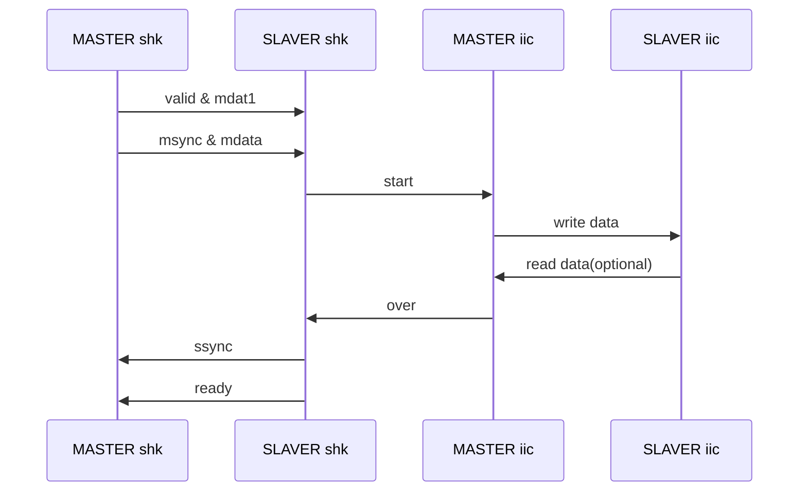
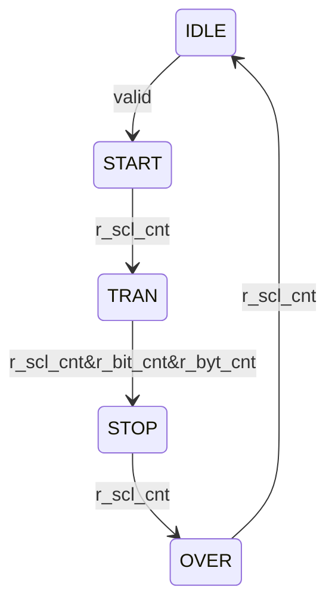

```mermaid
gantt
    title IIC timing
    dateFormat X
    axisFormat %s
    section IIC design
    NB_SCL_CNT:  0,100
    NB_WR_POINT: 25,26
    NB_SCL_RISE: 50,51
    NB_RD_POINT: 75,76
    section IIC timing
    SCL=1 : 50,100
    SCL=0 : 0,50
    SDO   : 25,125
    SDI   : 75,175
    
```

`timescale 1ns / 1ps
/*

<details>

```verilog
*/
// *******************************************************************************
// Company: Fpga Publish
// Engineer: FP 
// 
// Create Date: 2023/09/14 21:28:04
// Design Name: 
// Module Name: shk_to_iic
// Project Name: 
// Target Devices: ZYNQ7010 | XCZU2CG | Kintex7
// Tool Versions: 2021.1
// Description: 
//         * 
// Dependencies: 
//         * 
// Revision: 0.01 
// Revision 0.01 - File Created
//          1.1  - fix width not match
// Additional Comments:
// 
// *******************************************************************************
/* end verilog
```

</details>



<details>

```verilog
*/
module shk_to_iic #(
    //mode
    parameter MD_SIM_ABLE = 0,
    //number
    parameter NB_SYS_PER  = 10, //ns
    parameter NB_SCL_PER  = 10_000, //ns
    parameter NB_BYT_ONC  = 8, //
    parameter NB_ACK_BIT  = 1, //1bit ack
    //shake bus
    parameter WD_SHK_DATA = 8,
    parameter WD_SHK_ADDR = 16,
    //width
    parameter WD_ERR_INFO = 4
)(
    //system signals
    input           i_sys_clk  ,  
    input           i_sys_resetn,  
    //shake slaver
    input                       s_shk_0_valid,
    input                       s_shk_0_msync,
    input    [WD_SHK_DATA-1:0]  s_shk_0_mdata,
    input    [WD_SHK_DATA-1:0]  s_shk_0_mdat1, //read length
    input    [WD_SHK_ADDR-1:0]  s_shk_0_maddr,
    output                      s_shk_0_ready,
    output                      s_shk_0_ssync,
    output   [WD_SHK_DATA-1:0]  s_shk_0_sdata,
    output   [WD_SHK_ADDR-1:0]  s_shk_0_saddr,
    //iic master
    inout                       m_iic_0_sda,
    output                      m_iic_0_scl,
    //error info feedback
    output   [WD_ERR_INFO-1:0]  m_err_shk_info1
);
//========================================================
//function to math and logic
//function y = [log2(N)]
function automatic integer LOG2_N(input integer N);
begin
    N = N - 1;
    for(LOG2_N = 0; N > 0; LOG2_N = LOG2_N + 1)
    begin
        N = N >> 1;
    end
end 
endfunction
//========================================================
//localparam to converation and calculate
localparam NB_SCL_CNT = NB_SCL_PER / NB_SYS_PER;
localparam WD_SCL_CNT = LOG2_N(NB_SCL_CNT);
localparam NB_WR_POINT = NB_SCL_CNT * 1 / 4;
localparam NB_SCL_RISE = NB_SCL_CNT * 2 / 4;
localparam NB_RD_POINT = NB_SCL_CNT * 3 / 4;
localparam WD_BYT_ONC  = LOG2_N(NB_BYT_ONC);
localparam WD_BIT_ADR  = LOG2_N(WD_SHK_DATA) + 1; //1.1  - fix width not match 
/* end verilog
```
</details>



<details>

```verilog
*/

//========================================================
//register and wire to time sequence and combine
// ----------------------------------------------------------
// shk input data
reg [WD_SHK_DATA-1:0]  r_shk_0_mdata_fifo [0:NB_BYT_ONC-1];
reg [WD_SHK_DATA-1:0]  r_shk_0_rd_numb; //mdat1
reg [WD_SHK_ADDR-1:0]  r_shk_0_maddr = 0;
reg [WD_SHK_DATA-1:0]  r_shk_0_mdata_tmp;
reg [WD_SHK_ADDR-1:0]  r_shk_0_wr_numb;
// ----------------------------------------------------------
// shk output data
reg                    r_shk_0_ready;
reg                    r_shk_0_ssync;
reg [WD_SHK_DATA-1:0]  r_shk_0_sdata;
reg [WD_SHK_ADDR-1:0]  r_shk_0_saddr;

// ----------------------------------------------------------
// iic timing
reg [WD_SCL_CNT-1:0]  r_scl_cnt;
reg [WD_SHK_DATA-1:0] r_bit_cnt;
reg [WD_BIT_ADR -1:0] r_bit_cnt_adr;
reg [WD_SHK_DATA-1:0] r_byt_cnt;
reg [WD_BYT_ONC-1:0]  r_adr_cnt;
wire                  w_rd_flag;
// ----------------------------------------------------------
// iic interface
reg  r_iic_0_scl;
reg  r_iic_0_sdo;
reg  r_iic_0_tri;
wire w_iic_0_sdi;
reg [WD_SHK_DATA-1:0] r_iic_0_rd;
//========================================================
//always and assign to drive logic and connect
/* end verilog
```

</details>



<details>

```verilog
*/

/* @begin state machine */
//state name
localparam IDLE         = 0;
localparam START        = 1;
localparam TRAN         = 2;
localparam STOP         = 3;
localparam OVER         = 4;
//state variable
reg [3:0] cstate = IDLE;

//state logic
always @(posedge i_sys_clk)
    if(!i_sys_resetn)
    begin
       cstate <= IDLE;
    end
    else
    begin
        case(cstate)
            IDLE : if(s_shk_0_valid) //wheter goto next state
                begin  
                    if(1) //which state to go
                    begin
                        cstate <= START;
                    end
                end
            START: if(r_scl_cnt >= NB_SCL_CNT -1'b1)
                begin
                    if(1) //
                    begin
                        cstate <= TRAN;
                    end
                end
            TRAN: if(r_scl_cnt >= NB_SCL_CNT -1'b1
                &&   r_bit_cnt == WD_SHK_DATA + NB_ACK_BIT - 1'b1
                &&   r_byt_cnt == r_shk_0_rd_numb + r_shk_0_wr_numb - 1'b1) //state change:
                begin
                    if(1) //state switch:
                    begin
                        cstate <= STOP;
                    end
                end
            STOP: if(r_scl_cnt >= NB_SCL_CNT -1'b1) //state change:
                begin
                    if(1) //state switch:
                    begin
                        cstate <= OVER;
                    end
                end
            OVER: if(r_scl_cnt >= NB_SCL_CNT -1'b1) //state change:
                begin
                    if(1) //state switch:
                    begin
                        cstate <= IDLE;
                    end
                end
            default: cstate <= IDLE;
        endcase
    end
/* @end state machine  */
// ----------------------------------------------------------
// shk data
always@(posedge i_sys_clk)
begin
    if(cstate == IDLE) //state IDLE reset
    begin
        if(s_shk_0_valid)
            begin
                r_shk_0_maddr <= s_shk_0_maddr;
                r_shk_0_rd_numb <= s_shk_0_mdat1;
            end
    end
end
generate genvar i;
    for(i = 0; i < NB_BYT_ONC; i = i + 1)
    begin:FOR_NB_BYT_ONC
        always@(posedge i_sys_clk)
        begin
            if(cstate == IDLE) //state IDLE reset
            begin
                r_shk_0_mdata_fifo[i] <= 1'b0;
            end
            else if(cstate == START
                &&  s_shk_0_msync)
            begin
                r_shk_0_mdata_fifo[0] <= s_shk_0_mdata;
                if(i > 0)
                begin
                    r_shk_0_mdata_fifo[i] <= r_shk_0_mdata_fifo[i-1];
                end 
            end
        end
    end
endgenerate
always@(posedge i_sys_clk)
begin
    if(cstate == IDLE) //state IDLE reset
    begin
        r_shk_0_mdata_tmp <= 1'b0;
    end
    else if(cstate == TRAN)
    begin
        r_shk_0_mdata_tmp <= r_shk_0_mdata_fifo[r_adr_cnt];
    end
end
always@(posedge i_sys_clk)
begin
    if(cstate == IDLE) //state IDLE reset
    begin
        r_shk_0_wr_numb <= 1'b0;
    end
    else if(cstate == START)
    begin
        if(s_shk_0_msync)
        begin
            r_shk_0_wr_numb <= r_shk_0_wr_numb + 1'b1;
        end
    end
end
// ----------------------------------------------------------
// shk output data
// reg                    r_shk_0_ready;
// reg                    r_shk_0_ssync;
// reg [WD_SHK_DATA-1:0]  r_shk_0_sdata;
// reg [WD_SHK_ADDR-1:0]  r_shk_0_saddr;
always@(posedge i_sys_clk)
begin
    if(cstate == IDLE) //state IDLE reset
    begin
        r_shk_0_ready <= 1'b0;
    end
    else if(cstate == OVER && r_scl_cnt >= NB_SCL_CNT - 1'b1)
    begin
        r_shk_0_ready <= 1'b1;
    end
end
always@(posedge i_sys_clk)
begin
    if(cstate == IDLE) //state IDLE reset
    begin
        r_shk_0_ssync <= 1'b0;
    end
    else if(cstate == TRAN)
    begin
        if(w_rd_flag
        && r_bit_cnt >= WD_SHK_DATA + NB_ACK_BIT - 1'b1
        && r_scl_cnt >= NB_SCL_CNT - 1'b1)
        begin
            r_shk_0_ssync <= 1'b1;
        end
        else 
        begin
            r_shk_0_ssync <= 1'b0;
        end
    end
    else if(cstate == STOP)
    begin
        r_shk_0_ssync <= 1'b0;
    end
end
always@(posedge i_sys_clk)
begin
    if(cstate == IDLE) //state IDLE reset
    begin
        r_shk_0_sdata <= 1'b0;
    end
    else if(cstate == TRAN)
    begin
        if(w_rd_flag
        && r_bit_cnt >= WD_SHK_DATA + NB_ACK_BIT - 1'b1
        && r_scl_cnt >= NB_SCL_CNT - 1'b1)
        begin
            r_shk_0_sdata <= r_iic_0_rd;
        end
    end
end
always@(posedge i_sys_clk)
begin
    if(cstate == IDLE) //state IDLE reset
    begin
        if(s_shk_0_valid)
        begin
            r_shk_0_saddr <= s_shk_0_maddr;
        end
        
    end
    
end
assign s_shk_0_ready = r_shk_0_ready;
assign s_shk_0_ssync = r_shk_0_ssync;
assign s_shk_0_sdata = r_shk_0_sdata;
assign s_shk_0_saddr = r_shk_0_saddr;

// ----------------------------------------------------------
// iic timing
always@(posedge i_sys_clk)
begin
    if(cstate == IDLE) //state IDLE reset
    begin
        r_scl_cnt <= 1'b0;
    end
    else if(cstate == START
        ||  cstate == TRAN
        ||  cstate == STOP
        ||  cstate == OVER)
    begin
        r_scl_cnt <= (r_scl_cnt >= NB_SCL_CNT - 1'b1) ? 1'b0 : r_scl_cnt + 1'b1;
        
    end
end
always@(posedge i_sys_clk)
begin
    if(cstate == IDLE) //state IDLE reset
    begin
        r_bit_cnt <= 1'b0;
    end
    else if(cstate == TRAN
        &&  r_scl_cnt >= NB_SCL_CNT - 1'b1)
    begin
        r_bit_cnt <= (r_bit_cnt >= WD_SHK_DATA + NB_ACK_BIT - 1'b1) ? 1'b0 : 
                      r_bit_cnt + 1'b1;
    end
end
always@(posedge i_sys_clk)
begin
    if(cstate == IDLE) //state IDLE reset
    begin
        r_bit_cnt_adr <= 1'b0;
    end
    else if(cstate == START)
    begin
        r_bit_cnt_adr <= WD_SHK_DATA - 1'b1;
    end
    else if(cstate == TRAN
        &&  r_scl_cnt >= NB_SCL_CNT - 1'b1)
    begin
        r_bit_cnt_adr <=   (r_bit_cnt_adr == 0) ? WD_SHK_DATA : 
                            r_bit_cnt_adr - 1'b1;
    end
end
always@(posedge i_sys_clk)
begin
    if(cstate == IDLE) //state IDLE reset
    begin
        r_byt_cnt <= 1'b0;
    end
    else if(cstate == TRAN
        &&  r_bit_cnt >= WD_SHK_DATA + NB_ACK_BIT - 1'b1
        &&  r_scl_cnt >= NB_SCL_CNT - 1'b1)
    begin
        r_byt_cnt <= r_byt_cnt + 1'b1;
    end
end
always@(posedge i_sys_clk)
begin
    if(cstate == IDLE) //state IDLE reset
    begin
        r_adr_cnt <= 1'b0;
    end
    else if(cstate == START
        && r_scl_cnt >= NB_SCL_CNT - 1'b1)
    begin
        r_adr_cnt <= r_shk_0_wr_numb - 1'b1;
    end
    else if(cstate == TRAN
        &&  r_bit_cnt >= WD_SHK_DATA + NB_ACK_BIT - 1'b1
        &&  r_scl_cnt >= NB_SCL_CNT - 1'b1)
    begin
        r_adr_cnt <=    r_adr_cnt == 0 ? 0 :
                        r_adr_cnt - 1'b1;
    end
end
assign w_rd_flag = r_byt_cnt >= r_shk_0_wr_numb;
// ----------------------------------------------------------
// iic interface
always@(posedge i_sys_clk)
begin
    if(cstate == IDLE) //state IDLE reset
    begin
        r_iic_0_scl <= 1'b1;
    end
    else if(cstate == START )
    begin
        if(r_scl_cnt == NB_SCL_CNT - 1'b1)
            begin
                r_iic_0_scl <= 1'b0;
            end
        
    end
    else if(cstate == TRAN)
    begin
        if(r_scl_cnt == NB_SCL_CNT - 1'b1)
        begin
            r_iic_0_scl <= 1'b0;
        end
        else if(r_scl_cnt == NB_SCL_RISE - 1'b1)
        begin
            r_iic_0_scl <= 1'b1;
        end
    end
    else if(cstate == OVER)
    begin
        if(r_scl_cnt == NB_SCL_RISE - 1'b1)
        begin
            r_iic_0_scl <= 1'b1;
        end
    end
end
always@(posedge i_sys_clk)
begin
    if(cstate == IDLE) //state IDLE reset
    begin
        r_iic_0_sdo <= 1'b1;
        r_iic_0_tri <= 1'b0; //write in 0 and read in 1
    end
    else if(cstate == START)
    begin
        if(r_scl_cnt == NB_SCL_RISE - 1'b1)
        begin
            r_iic_0_sdo <= 1'b0;
            r_iic_0_tri <= 1'b0;
        end
    end
    else if(cstate == TRAN
        &&  r_scl_cnt == NB_WR_POINT - 1'b1)
    begin
        if(!w_rd_flag) //write
        begin
            if(r_bit_cnt >= NB_ACK_BIT + WD_SHK_DATA - 1'b1)
            begin
                r_iic_0_sdo <= 1'b0;
                r_iic_0_tri <= 1'b1;
            end
            else 
            begin
                r_iic_0_sdo <= r_shk_0_mdata_tmp[r_bit_cnt_adr];
                r_iic_0_tri <= 1'b0;
            end
        end
        else 
        begin
            if(r_bit_cnt >= NB_ACK_BIT + WD_SHK_DATA - 1'b1)
            begin
                r_iic_0_sdo <= 1'b0;
                r_iic_0_tri <= 1'b0;
            end
            else 
            begin
                r_iic_0_sdo <= r_iic_0_sdo;
                r_iic_0_tri <= 1'b1;
            end
        end
    end
    else if(cstate == STOP)
    begin
        if(r_scl_cnt == NB_RD_POINT - 1'b1)
        begin
            r_iic_0_sdo <= 1'b1;
            r_iic_0_tri <= 1'b0;
        end
        else if(r_scl_cnt == NB_WR_POINT - 1'b1)
        begin
            r_iic_0_sdo <= 1'b0;
            r_iic_0_tri <= 1'b0;
        end
    end
    
end
always@(posedge i_sys_clk)
begin
    if(cstate == IDLE) //state IDLE reset
    begin
        r_iic_0_rd <= 1'b0;
    end
    else if(cstate == TRAN)
    begin
        if(w_rd_flag
        && r_scl_cnt == NB_RD_POINT - 1'b1
        && !(r_bit_cnt >= NB_ACK_BIT + WD_SHK_DATA - 1'b1))
        begin
            r_iic_0_rd <= {r_iic_0_rd[WD_SHK_DATA-2:0],w_iic_0_sdi};
        end
    end
end
assign m_iic_0_scl = r_iic_0_scl;
// inout convert
assign m_iic_0_sda = r_iic_0_tri ? 1'bz : r_iic_0_sdo;
assign w_iic_0_sdi = m_iic_0_sda;

//========================================================
//module and task to build part of system

//========================================================
//expand and plug-in part with version 

//========================================================
//ila and vio to debug and monitor


endmodule


