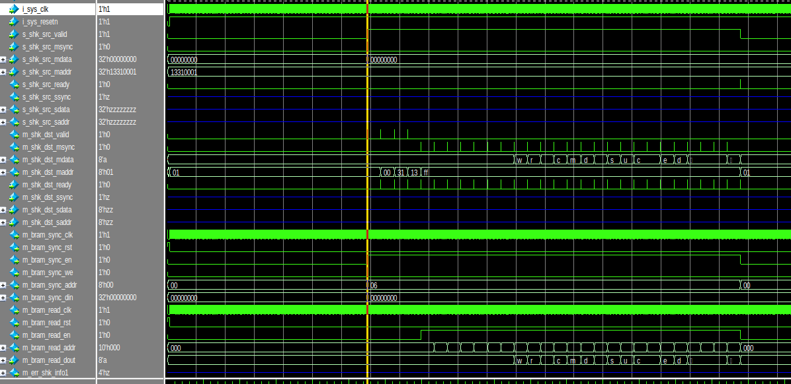
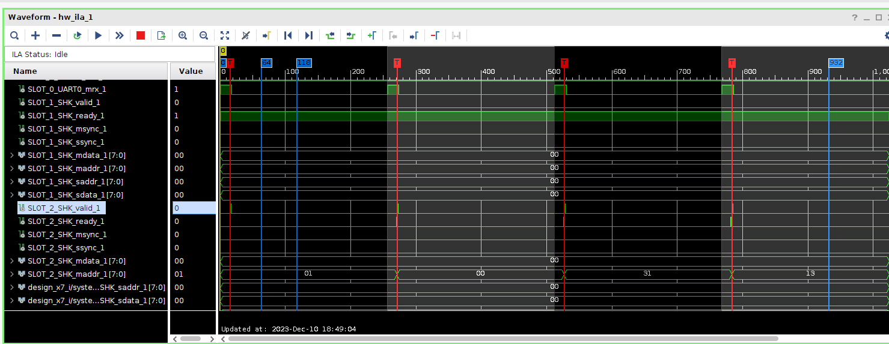

`timescale 1ns / 1ps
/*
           
 <details> 
           
```verilog
*/
// *******************************************************************************
// Company: Fpga Publish
// Engineer: FP 
// 
// Create Date: 2023/12/03 13:02:54
// Design Name: 
// Module Name: shk_wr_cmd
// Project Name: 
// Target Devices: ZYNQ7010 | XCZU2CG | Kintex7
// Tool Versions: 2021.1 || 2022.2
// Description: 
//         * 
// Dependencies: 
//         * 
// Revision: 0.01 
// Revision 0.01 - File Created
// Additional Comments:
// 
// *******************************************************************************

module shk_wr_cmd #(
    //mode
    parameter MD_SIM_ABLE = 0,
    //number
    //shake bus
    parameter WD_SHK_DATA = 32,
    parameter WD_SHK_ADDR = 32,
    //shake bus
    parameter WD_DST_DATA = 8,
    parameter WD_DST_ADDR = 8,
    //bram bus
    parameter WD_SYNC_ADR = 8,
    parameter WD_READ_ADR = 10,
    parameter NB_READ_LAT = 2, //MIN 2
    //width
    parameter WD_ERR_INFO = 4
   )(
    //system signals
    input           i_sys_clk   ,  
    input           i_sys_resetn,  
    //shake slaver
    input                       s_shk_src_valid, //shake module
    input                       s_shk_src_msync,
    input    [WD_SHK_DATA-1:0]  s_shk_src_mdata,
    input    [WD_SHK_ADDR-1:0]  s_shk_src_maddr,
    output                      s_shk_src_ready,
    output                      s_shk_src_ssync,
    output   [WD_SHK_DATA-1:0]  s_shk_src_sdata,
    output   [WD_SHK_ADDR-1:0]  s_shk_src_saddr,
    //shake master
    output                      m_shk_dst_valid, //1 direction shk
    output                      m_shk_dst_msync,
    output   [WD_DST_DATA-1:0]  m_shk_dst_mdata,
    output   [WD_DST_ADDR-1:0]  m_shk_dst_maddr,
    input                       m_shk_dst_ready,
    input                       m_shk_dst_ssync,
    input    [WD_DST_DATA-1:0]  m_shk_dst_sdata,
    input    [WD_DST_ADDR-1:0]  m_shk_dst_saddr, 
    //bram data write
    output                      m_bram_sync_clk ,
    output                      m_bram_sync_rst ,
    output                      m_bram_sync_en  ,
    output                      m_bram_sync_we  ,
    output   [WD_SYNC_ADR-1:0]  m_bram_sync_addr,
    output   [WD_SHK_DATA-1:0]  m_bram_sync_din ,
    //bram data read
    output                      m_bram_read_clk ,
    output                      m_bram_read_rst ,
    output                      m_bram_read_en  ,
    output   [WD_READ_ADR-1:0]  m_bram_read_addr,
    input    [WD_DST_DATA-1:0]  m_bram_read_dout,
    
    
    //error info feedback
    output   [WD_ERR_INFO-1:0]  m_err_shk_info1
);
//========================================================
//function to math and logic
function automatic integer LOG2(input integer N);
begin
    N = N - 1;
    for(LOG2 = 0; N > 0; LOG2 = LOG2 + 1)
    begin
        N = N >> 1;
    end
end 
endfunction

//========================================================
//localparam to converation and calculate
//width match with input
localparam NB_SRC_DIV_DST = WD_SHK_DATA / WD_DST_DATA;
localparam WD_SRC_DIV_DST = LOG(NB_SRC_DIV_DST);
//========================================================
//register and wire to time sequence and combine
// ----------------------------------------------------------
// src shk
reg                    r_shk_src_valid;
reg                    r_shk_src_msync;
reg [WD_SHK_DATA-1:0]  r_shk_src_mdata;
reg [WD_SHK_ADDR-1:0]  r_shk_src_maddr;
wire [WD_DST_DATA-1:0] w_shk_src_maddr_arry [0:NB_SRC_DIV_DST-1];
reg                    r_shk_src_ready;

assign s_shk_src_ready = r_shk_src_ready;
// ----------------------------------------------------------
// wr addr
reg [WD_SRC_DIV_DST-1:0] r_wr_addr_cunt;
// ----------------------------------------------------------
// wr data in wr bram
reg                    r_bram_sync_en  ;
reg                    r_bram_sync_we  ;
reg [WD_SYNC_ADR-1:0]  r_bram_sync_addr;
reg [WD_SHK_DATA-1:0]  r_bram_sync_din ;

assign m_bram_sync_clk  = i_sys_clk     ; //clock region
assign m_bram_sync_rst  = ~i_sys_resetn ;
assign m_bram_sync_en   = r_bram_sync_en  ;
assign m_bram_sync_we   = r_bram_sync_we  ;
assign m_bram_sync_addr = r_bram_sync_addr;
assign m_bram_sync_din  = r_bram_sync_din ;
// ----------------------------------------------------------
// wr data in rd bram
reg                    r_bram_read_en  ;
reg [WD_READ_ADR-1:0]  r_bram_read_addr;
reg [NB_READ_LAT-1:0]  r_bram_read_sync;

assign   m_bram_read_clk  = i_sys_clk    ;
assign   m_bram_read_rst  = ~i_sys_resetn;
assign   m_bram_read_en   = r_bram_read_en  ;
assign   m_bram_read_addr = r_bram_read_addr;
assign   m_bram_read_sync = r_bram_read_sync;
// ----------------------------------------------------------
// dst shk
reg                    r_shk_dst_valid;
reg                    r_shk_dst_msync;
reg [WD_DST_DATA-1:0]  r_shk_dst_mdata;
reg [WD_DST_ADDR-1:0]  r_shk_dst_maddr;
reg                    r_shk_dst_ready;
wire                   w_shk_dst_ready_pos;
wire                   w_shk_dst_ready_neg;
reg                    r_shk_dst_ssync;
reg [WD_DST_DATA-1:0]  r_shk_dst_sdata;
reg [WD_DST_ADDR-1:0]  r_shk_dst_saddr;

assign m_shk_dst_valid = r_shk_dst_valid;
assign m_shk_dst_msync = r_shk_dst_msync;
assign m_shk_dst_mdata = r_shk_dst_mdata;
assign m_shk_dst_maddr = r_shk_dst_maddr;
//========================================================
//always and assign to drive logic and connect
// ----------------------------------------------------------
// dst shk
always@(posedge i_sys_clk)
begin
    if(!i_sys_resetn) //system reset
    begin
        r_shk_dst_ready <= 1'b0; //
    end
    else if(1) //
    begin
        r_shk_dst_ready <= m_shk_dst_ready;  //
    end
end
assign w_shk_dst_ready_pos = m_shk_dst_ready && !r_shk_dst_ready;
assign w_shk_dst_ready_neg = !m_shk_dst_ready && r_shk_dst_ready;

/* end verilog
```
           
 </details> 
           
```mermaid
stateDiagram
IDLE-->START : src_valid 
START-->WR_ADDR: dst_valid 
WR_ADDR-->WR_DATA: dst_msync 
WR_ADDR-->RELEASE: no_data
WR_DATA-->RELEASE: dst_ready 
RELEASE-->OVER: src_ready 
OVER-->IDLE: state over 
```
           
 <details> 
           
```verilog
*/
/* @begin state machine */
//state name
localparam IDLE         = 0;
localparam START        = 1;
localparam WR_ADDR      = 2;
localparam WR_DATA      = 3;
localparam RELEASE      = 4;
localparam OVER         = 5;
//state variable
reg [3:0] cstate    = IDLE;
reg [3:0] cstate_d1 = IDLE;
//cstate delay one clock
always@(posedge i_sys_clk)
begin
    if(!i_sys_resetn) //system reset
    begin
        cstate_d1 <= IDLE; //
    end
    else if(1) //
    begin
        cstate_d1 <=  cstate; //
    end
end
//state logic
always @(posedge i_sys_clk)
    if(!i_sys_resetn)
    begin
       cstate <= IDLE;
    end
    else
    begin
        case(cstate)
            IDLE : if(1) //whether goto next state
                begin  
                    if(1) //which state to go
                    begin
                        cstate <= START;
                    end
                end
            START: if(s_shk_src_valid)
                begin
                    if(1)
                    begin
                        cstate <= WR_ADDR;
                    end
                end
            WR_ADDR: if(r_wr_addr_cunt == NB_SRC_DIV_DST - 1'b1
                    && w_shk_dst_ready_pos) //state change: wr addr last
                begin
                    if(r_bram_sync_addr != 0) //state switch: has data wrtie
                    begin
                        cstate <= WR_DATA;
                    end
                    else 
                    begin
                        cstate <= RELEASE;
                    end
                end
            WR_DATA: if(w_shk_dst_ready_pos
                    &&  r_bram_read_addr == {r_bram_sync_addr,{WD_SRC_DIV_DST{1'b0}}} - 1'b1) //state change:
                begin
                    if(1) //state switch:
                    begin
                        cstate <= RELEASE;
                    end
                end
            RELEASE: if(!s_shk_src_valid) //state change:
                begin
                    if(1) //state switch:
                    begin
                        cstate <= OVER;
                    end
                end
            OVER: if(1) //state change:
                begin
                    if(1) //state switch:
                    begin
                        cstate <= IDLE;
                    end
                end
            default: cstate <= IDLE;
        endcase
    end
/* @end state machine  */
// ----------------------------------------------------------
// src shk
always@(posedge i_sys_clk)
begin
    if(cstate == IDLE) //state IDLE reset
    begin
        r_shk_src_maddr <= 1'b0;
    end
    else if(cstate == START) //&& s_shk_src_valid
    begin
        r_shk_src_maddr <= s_shk_src_maddr;
    end
end
always@(posedge i_sys_clk)
begin
    if(cstate == IDLE) //state IDLE reset
    begin
        r_wr_addr_cunt <= 1'b0;
    end
    else if(cstate == WR_ADDR)
    begin
        if(w_shk_dst_ready_pos)
        begin
            r_wr_addr_cunt <= r_wr_addr_cunt + 1'b1;
        end
    end
end
always@(posedge i_sys_clk)
begin
    if(cstate == IDLE) //state IDLE reset
    begin
        r_shk_src_ready <= 1'b0;
    end
    else if(cstate == RELEASE)
    begin
        r_shk_src_ready <= 1'b1;
    end
end
// ----------------------------------------------------------
// wr data in wr bram
always@(posedge i_sys_clk)
begin
    if(cstate == IDLE) //state IDLE reset
    begin
        r_bram_sync_en <= 1'b0;
    end
    else if(cstate == WR_ADDR)
    begin
        r_bram_sync_en <= 1'b1;
    end
end
always@(posedge i_sys_clk)
begin
    if(cstate == IDLE) //state IDLE reset
    begin
        r_bram_sync_we <= 1'b0;
        r_bram_sync_din <= 1'b0;
    end
    else if(cstate == WR_ADDR)
    begin
        r_bram_sync_we <= s_shk_src_msync;
        r_bram_sync_din <= s_shk_src_mdata;
    end
end
always@(posedge i_sys_clk)
begin
    if(cstate == IDLE) //state IDLE reset
    begin
        r_bram_sync_addr <= 1'b0;
    end
    else if(cstate == WR_ADDR)
    begin
        if(r_bram_sync_we)
        begin
            r_bram_sync_addr <= r_bram_sync_addr + 1'b1;
        end
    end
end
// ----------------------------------------------------------
// wr data in rd bram
always@(posedge i_sys_clk)
begin
    if(cstate == IDLE) //state IDLE reset
    begin
        r_bram_read_en <= 1'b0;
    end
    else if(cstate == WR_DATA) //
    begin
        r_bram_read_en <= 1'b0;
    end
end
always@(posedge i_sys_clk)
begin
    if(cstate == IDLE) //state IDLE reset
    begin
        r_bram_read_addr <= 1'b0;
    end
    else if(cstate == WR_DATA)
    begin
        if(w_shk_dst_ready_pos)
        begin
            r_bram_read_addr <= r_bram_read_addr + 1'b1;
        end
    end
end

always@(posedge i_sys_clk)
begin
    if(cstate == IDLE) //state IDLE reset
    begin
        r_bram_read_sync <= 1'b0;
    end
    else if(cstate == WR_DATA)
    begin
        if(cstate_d1 == WR_ADDR) //just write ADDR finish
        begin
            r_bram_read_sync <= {r_bram_read_sync[NB_READ_LAT-2:0],1'b1};
        end
        else if(w_shk_dst_ready_neg)
        begin
            r_bram_read_sync <= {r_bram_read_sync[NB_READ_LAT-2:0],1'b1};
        end
        else 
        begin
            r_bram_read_sync <= {r_bram_read_sync[NB_READ_LAT-2:0],1'b0};
        end
    end
end
// ----------------------------------------------------------
// dst shk
always@(posedge i_sys_clk)
begin
    if(cstate == IDLE) //state IDLE reset
    begin
        r_shk_dst_valid <= 1'b0;
    end
    else if(cstate == START)
    begin
        if(s_shk_src_valid)
        begin
            r_shk_dst_valid <= 1'b1;
        end
    end
    else if(cstate == WR_ADDR)
    begin
        if(w_shk_dst_ready_neg)
        begin
            r_shk_dst_valid <= 1'b1;
        end
        else 
        begin
            r_shk_dst_valid <= 1'b0;
        end
    end
end
generate genvar i;
    for(i = 0; i < NB_SRC_DIV_DST - 1; i = i + 1) //just temp high 2 BYTE
    begin:FOR_NB_SRC_DIV_DST
        assign w_shk_src_maddr_arry[i] = r_shk_src_maddr[WD_DST_ADDR*(i+2)-1:WD_DST_ADDR*(i+1)];
    end
endgenerate
always@(posedge i_sys_clk)
begin
    if(cstate == IDLE) //state IDLE reset
    begin
        r_shk_dst_maddr <= 1'b0;
    end
    else if(cstate == START)
    begin
        r_shk_dst_maddr <= s_shk_src_maddr[WD_DST_ADDR-1:0];
    end
    else if(cstate == WR_ADDR)
    begin
        if(w_shk_dst_ready_pos)
        begin
            r_shk_dst_maddr <= w_shk_src_maddr_arry[r_wr_addr_cunt]; //
        end
    end
end
//wr data
always@(posedge i_sys_clk)
begin
    if(cstate == IDLE) //state IDLE reset
    begin
        r_shk_dst_msync <= 1'b0;
        r_shk_dst_mdata <= 1'b0;
    end
    else if(cstate == WR_DATA)
    begin
        r_shk_dst_msync <= r_bram_read_sync[NB_READ_LAT-1];
        r_bram_read_sync <= m_bram_read_dout;
    end
end

//========================================================
//module and task to build part of system

//========================================================
//expand and plug-in part with version 

//========================================================
//ila and vio to debug and monitor

endmodule
              
/* end verilog
```           
              
 </details>   
              
## sim        
    

## ila 

          
*/            