`timescale 1ns / 1ps
/*
           
 <details> 
           
```verilog
*/
// *******************************************************************************
// Company: Fpga Publish
// Engineer: FP 
// 
// Create Date: 2023/09/28 22:40:30
// Design Name: 
// Module Name: video_to_bram
// Project Name: 
// Target Devices: ZYNQ7010 | XCZU2CG | Kintex7
// Tool Versions: 2021.1 || 2022.2
// Description: 
//         * 
// Dependencies: 
//         * 
// Revision: 0.01 
// Revision 0.01 - File Created
// Additional Comments:
// 
// *******************************************************************************

module video_to_bram #(
    //mode
    parameter MD_SIM_ABLE = 0,
    //number
    
    //width
    parameter WD_BRAM_ADDR = 9,
    parameter WD_BRAM_DATA = 8,
    parameter WD_VIDEO_DATA = 8,
    parameter WD_ERR_INFO = 4
   )(
    //video interface
    input                       s_video_src_clock,
    input                       s_video_src_fsync, //equal with sensor vsync
    input                       s_video_src_vsync, //equal with sensor href
    input                       s_video_src_hsync,
    input                       s_video_src_psync,
    input   [WD_VIDEO_DATA-1:0] s_video_src_vdata,
    //bram interface
    output  [WD_BRAM_ADDR-1:0]  m_bram_dst_addr,
    output                      m_bram_dst_clk ,
    output  [WD_BRAM_DATA-1:0]  m_bram_dst_din ,
    input   [WD_BRAM_DATA-1:0]  m_bram_dst_dout,
    output                      m_bram_dst_en  ,
    output                      m_bram_dst_rst ,
    output                      m_bram_dst_we  ,
    //write info
    output                      m_info_wr_clck,
    output                      m_info_wr_last,
    //error info feedback
    output   [WD_ERR_INFO-1:0]  m_err_video_info1
);
//========================================================
//function to math and logic

//========================================================
//localparam to converation and calculate

/* end verilog
```

```mermaid
gantt 
title video to bram timing
dateFormat X
axisFormat %s
section design
s_video_src_vsync: 0,100
m_bram_dst_we: 10,90
m_info_wr_last:  99,100
```
           
 </details> 
           

           
 <details> 
           
```verilog
*/

//========================================================
//register and wire to time sequence and combine
// ----------------------------------------------------------
// system signals
wire           i_sys_clk   ;  
wire           i_sys_resetn;  
// ----------------------------------------------------------
// video src
reg  r_video_src_fsync;
wire w_video_src_fsync_pos;
reg  r_video_src_vsync;
wire w_video_src_vsync_pos;
wire w_video_src_vsync_neg;
// ----------------------------------------------------------
// bram master
reg [WD_BRAM_ADDR-1:0]  r_bram_dst_addr;
reg [WD_BRAM_DATA-1:0]  r_bram_dst_din ;
reg                     r_bram_dst_en  ;
reg                     r_bram_dst_rst ;
reg                     r_bram_dst_we  ;
// ----------------------------------------------------------
// write info
reg  r_info_wr_last;

//========================================================
//always and assign to drive logic and connect
// ----------------------------------------------------------
// system signals
assign            i_sys_clk    = s_video_src_clock;  
assign            i_sys_resetn =  w_video_src_fsync_pos;
// ----------------------------------------------------------
// video src
always@(posedge i_sys_clk)
begin
    if(1) //
    begin
        r_video_src_fsync <= s_video_src_fsync;  //
        r_video_src_vsync <= s_video_src_vsync;
    end
end
assign w_video_src_fsync_pos = s_video_src_fsync && !r_video_src_fsync;
assign w_video_src_vsync_pos = s_video_src_vsync && !r_video_src_vsync;
assign w_video_src_vsync_neg = !s_video_src_vsync && r_video_src_vsync;
// ----------------------------------------------------------
// bram master
always@(posedge i_sys_clk)
begin
    if(!i_sys_resetn) //system reset
    begin
        r_bram_dst_addr <= 1'b0; //
    end
    else if(w_video_src_vsync_pos)
    begin
        r_bram_dst_addr <= 1'b0;
    end
    else if(r_bram_dst_we) //
    begin
        r_bram_dst_addr <= r_bram_dst_addr + 1'b1;  //
    end
end
always@(posedge i_sys_clk)
begin
    if(!i_sys_resetn) //system reset
    begin
        r_bram_dst_en <= 1'b0; //
        r_bram_dst_rst <= 1'b1;
    end
    else if(1) //
    begin
        r_bram_dst_en <= 1'b1;  //
        r_bram_dst_rst <= 1'b0;
    end
end
always@(posedge i_sys_clk)
begin
    if(!i_sys_resetn) //system reset
    begin
        r_bram_dst_we <= 1'b0; //
        
    end
    else if(s_video_src_vsync && s_video_src_psync) //
    begin
        r_bram_dst_we <= 1'b1;  //
        
    end
    else 
    begin
        r_bram_dst_we <= 1'b0;
    end
end
always@(posedge i_sys_clk)
begin
    if(!i_sys_resetn) //system reset
    begin
        r_bram_dst_din <= 1'b0; //
    end
    else if(s_video_src_vsync && s_video_src_psync) //
    begin
        r_bram_dst_din <= s_video_src_vdata;  //
    end
end
assign m_bram_dst_addr = r_bram_dst_addr;
assign m_bram_dst_clk  = i_sys_clk       ;
assign m_bram_dst_din  = r_bram_dst_din ;
assign m_bram_dst_en   = r_bram_dst_en  ;
assign m_bram_dst_rst  = r_bram_dst_rst ;
assign m_bram_dst_we   = r_bram_dst_we  ;
// ----------------------------------------------------------
// write info
always@(posedge i_sys_clk)
begin
    if(!i_sys_resetn) //system reset
    begin
        r_info_wr_last <= 1'b0; //
    end
    else if(w_video_src_vsync_neg) //
    begin
        r_info_wr_last <= 1'b1;  //
    end
    else 
    begin
        r_info_wr_last <= 1'b0;
    end
end
assign m_info_wr_last = r_info_wr_last;
assign m_info_wr_clck = i_sys_clk;
//========================================================
//module and task to build part of system

//========================================================
//expand and plug-in part with version 

//========================================================
//ila and vio to debug and monitor

endmodule